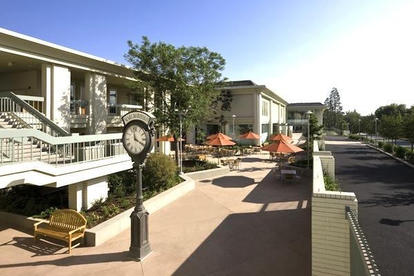

layout: true

.logo[

]

.logo2[
<a href="http://stem.marlborough.org" target="_blank">
http://stem.marlborough.org
</a>
]

---

.center[
# Open Educational Resources   for   Teachers

 

<a href="https://www.ncgs.org/professional-development/global-forum-on-girls-education-iii/" target="_blank">NCGS Global Forum on Girls' Education III</a>  
_Boston, MA_  
_Tuesday, June 28, 2021_  

 
]

.center.purple[
Darren Kessner, PhD  
Computer Science and Software Innovation   
Marlborough School  
Darren.Kessner@marlborough.org  
]

---

## About me

 
9th year at Marlborough School:

- Program Head in Computer Science and Software Innovation

- Math and Computer Science Instructor

 

Education / experience: 

* Mathematics (BS, MA), Bioinformatics (PhD)

* worked in software development for over 20 years
    - Anti-virus security
    - Application development 
    - Computer graphics
    - Scientific applications

---

## Marlborough School

* Girls independent school  in Los Angeles 

* ~500 students

* Middle School (7-9) and Upper School (10-12)

 

---

## Marlborough STEM+ Program

Emphasis on STEM activities that are creative, collaborative, and interdisciplinary:

* Computer Science

* Robotics (Andy Witman)

* Engineering (Dr. Lee Mirsky)

 

---

## Free & Open Source Software

_What is FOSS?_
    - freedom to use, copy, and change
    - source code published
_Benefits_
    - user control
    - privacy and security
    - quality and stability
    - no cost
_FOSS is everywhere_

    - every web service depends on FOSS running on servers:
        - Amazon Web Services, Google, Microsoft
        - Zoom, Facebook, Netflix, LinkedIn, Twitch, YouTube

    - every device uses FOSS:
        - Android (Linux)
        - Apple iOS/MacOS (BSD)

---

## Open Source Educational Software

       

.center[

 

 

<a href="https://www.arduino.cc/" target="_blank"> Arduino</a>

]

---

## Open Educational Resources

.center[

Online courses

 

Open textbooks

 

Public domain books

]

---

## Open Textbooks

AP Computer Science A

* <a href="http://math.hws.edu/javanotes" target="_blank">David J Eck, Introduction to Programming Using Java</a>
* <a href="https://en.wikibooks.org/wiki/Java_Programming" target="_blank">Wikibooks Java Programming</a>

Precalculus / Calculus

* <a href="https://openstax.org/details/books/precalculus" target="_blank">OpenStax Precalculus</a>
* <a href="https://openstax.org/details/books/calculus-volume-1" target="_blank">OpenStax Calculus Vol 1</a>
* <a href="https://openstax.org/details/books/calculus-volume-2" target="_blank">OpenStax Calculus Vol 2</a>
* <a href="https://openstax.org/details/books/calculus-volume-3" target="_blank">OpenStax Calculus Vol 3</a>

OpenStax also has books on Pre-Algebra, Algebra, Trigonometry, as well as many other
subjects.

---

## Open Data

.center[

Example: Social Security baby names  

 

Example: LAPD crime data 

]

---

  

.center[

  

Links to all the above resources and more:

### <a href="https://dkessner.github.io/TeacherResources" target="_blank">https://dkessner.github.io/TeacherResources</a>

]

